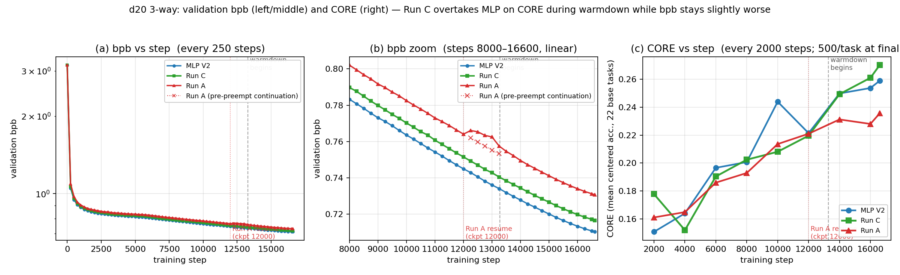

# SparseSpline-FFN

Structured-FFN replacements for transformer language models, with B-spline
basis lookups and a low-rank residual path. The package ships PyTorch
references plus the production CUDA / Triton kernels behind the same API,
and contains the reproducibility code for our NeurIPS 2026 submission on
**FFN placement and the structured-FFN trade-off curve**.

## Headline result (d20, 8.71 B tokens, 8 × H100)

| Method | val bpb | CORE @ step 16 600 | Δ CORE vs MLP V2 | spline layers / total |
|---|---:|---:|---:|---:|
| MLP V2 (baseline) | 0.7102 | 0.2589 | (baseline) | 0 / 20 |
| **Run C — RL-KV `late33` + λ-warmup** | 0.7166 | **0.2701** | **+0.0112** | 7 / 20 (layers 13..19) |
| Run A — RL-KV all-layers + λ-warmup | 0.7307 | 0.2356 | −0.0233 | 20 / 20 |

Two contrasts to read:

- **Run C beats MLP on CORE by +0.0112** with same token budget and **0.93 ×
  the FLOPs**. Bootstrap CI on 22 base tasks straddles zero on this single
  comparison (`[−0.018, +0.042]`, p ≈ 0.46) — the +0.0112 is directional, not
  formally significant on its own.
- **Run C beats Run A by +0.0345 CORE, p ≈ 0.011** (paired bootstrap, same 22
  tasks). This is the **load-bearing claim**: placement matters; all-layers
  is a *clean* negative control, not a noisy regression.

The decoupling is visible: Run C's bpb stays slightly above MLP throughout
training, but its CORE diverges upward during warm-down (panel (c)).



## Reproducing the analyses

The d20 8.71 B-token base trainings exist as Modal app artifacts
(`mlp_d20_reference_v2_seed0`, `full_rlkv_late33_grid5_lwarmup`,
`full_rlkv_b2_all_grid5_lwarmup`); per-step training logs are checked in
under `dispatcher_runs/`. The local scripts below recompute the headline
table and figures from those logs and from locked per-task data in
`benchmarks/data/`.

```bash
python -m pip install -e ".[dev]"

# 1) Bootstrap CI / sign test on per-task CORE deltas (10k resamples, seed 0)
python benchmarks/core_uncertainty_analysis.py \
    --json-out docs/_artifacts/core_uncertainty_2026-05-04.json

# 2) bpb + CORE trajectory plot (3 panels, PNG + PDF)
python benchmarks/extract_trajectories.py
python benchmarks/core_trajectory_plots.py

# 3) Same-token / same-wallclock cost table (Markdown)
python benchmarks/cost_normalized_table.py
```

All three are seed-locked and read all data from JSON files in
`benchmarks/data/`, so they reproduce bit-for-bit.

## H100 sequential sweeps (Modal)

Three dispatchers stage the next batch of P0 experiments. They default to
dry-run; pass `--execute` to fire. See `docs/STATUS_2026-05-05_placement_bundle.md`
for the frozen bundle's review notes and the recommended dispatch order.

```bash
# Order matters: placement first (the headline), Run A second (cheap negative
# control with no preempt confound), rank sweep third (capacity story).
python benchmarks/modal_h100_placement_sweep.py --execute   # ~3 hr
python benchmarks/modal_h100_runA_clean_200M.py  --execute   # ~30 min
python benchmarks/modal_h100_rank_sweep.py       --execute   # ~2.5 hr
```

The placement sweep covers `early33 / middle33 / late33 / late20 / late50`
at 200 M / 1 B-token scale, which converts the d20 single-point Run-C-vs-Run-A
contrast into a 5-cell line plot of CORE vs placement window.

## Architecture

The headline FFN class is **RL-Spline-KV**, defined as a PyTorch
reference in `src/sparsespline_ffn/rl_spline_kv_reference.py` and
backed by the production CUDA / Triton kernels in
`src/sparsespline_ffn/kernels/` and `src/sparsespline_ffn/cuda_ext/`.
Per layer:

```
   z := φ(x)             # ReLU² activation, retained for the base path
   delta := λ * spline_B2(z, C; grid=[-5, 5], G=20, r=32)
   y := concat(z, delta) -> dense readout
```

`C` has shape `[h, L, r]` with `L = G + 2 = 22`; the spline is a B2 basis
lookup of `z` against a fixed equispaced grid, accumulated through `r`
output channels. The `λ`-warmup ramps the residual scale from 0.25 → 1.0
over the first 1 000 training steps so the base path is fully trained
before the spline starts contributing.

Placement variants (selected via `--ffn-type` in the training fork; the
five non-`mlp` variants are arranged for the placement sweep above):

| `--ffn-type` | layers @ d20 | window size | use |
|---|---|---:|---|
| `mlp` | n/a | 0 | baseline |
| `rl_kv_b2` | 0..19 | 20 | all-layers (negative control) |
| `rl_kv_b2_late33` | 13..19 | 7 | **production winner** (Run C) |
| `rl_kv_b2_early33` | 0..5 | 6 | placement sweep cell |
| `rl_kv_b2_middle33` | 7..12 | 6 | placement sweep cell |
| `rl_kv_b2_late20` | 16..19 | 4 | placement sweep cell |
| `rl_kv_b2_late50` | 10..19 | 10 | placement sweep cell |

## Kernels

The optional CUDA / Triton path is opt-in via `use_kernel`; the PyTorch
reference (`use_kernel=False`) is the permanent oracle and the CPU
fallback. The `flash_spline_feature` autograd Function dispatches on a
`fwd_kernel` × `bwd_kernel` cross-product; production d20 training uses
`fwd_kernel="v11_cuda"` (H100 WGMMA) + `bwd_kernel="triton"` (autotunes for
arbitrary N). H100-only kernels (`v10_cuda`, `v11_cuda`, `wgmma_*`,
`hopper_cuda`) are exposed but auto-fall-back on lower compute capability.

Parity is enforced in two regimes by `tests/test_rlkv_kernel_parity.py`:

- **Regime A** (kernel vs einsum reference, both same input dtype) — bf16
  max_abs ≤ 5e-1 / mean_signed ≤ 2e-4. Catches gross math mistakes; loose
  because the reference's `sum` accumulates in fp32 while production
  kernels accumulate in bf16.
- **Regime B** (kernel-vs-kernel signed bias) — bf16 mean_signed ≤ **5e-6**.
  Reproduces the production v10-bug detection threshold; runs on H100.

The harness collects 53 tests; WGMMA-specific cases auto-skip on sm < 90.

## Install

```bash
cd sparsespline-ffn
python -m pip install -e ".[dev]"
```

CUDA / Triton:

```bash
python -m pip install -e ".[dev,cuda]"
```

## CLI

```bash
python -m sparsespline_ffn               # version + runtime + kernel availability
python -m sparsespline_ffn check-kernel  # actually runs the kernel end-to-end
python -m sparsespline_ffn config --d 768 --R_o 96 --R_i 96 --R_b 16
```

`check-kernel` exits 0 iff the Triton path runs end-to-end on this machine.

## Quick start

The earliest layer class is `FullMixTuckerFFN`, kept as the Phase-0
reference / control — not the headline production architecture (that is
RL-Spline-KV at the late33 placement). It is retained because Phase-0
ablations on Tucker variants gave the "placement matters" prediction
that the d20 results confirm at scale.

```python
import torch
from sparsespline_ffn import FullMixTuckerConfig, FullMixTuckerFFN

cfg = FullMixTuckerConfig(d=768, m=768, R_o=96, R_i=96, R_b=16, G=20)
ffn = FullMixTuckerFFN(cfg)
x = torch.randn(2, 128, 768)
y = ffn(x)
assert y.shape == x.shape
```

For per-layer schedule selection through MLP / Tucker / SimpleSpline
families, use `build_ffn` from `sparsespline_ffn.schedules`. For the
RL-KV production path, dispatch through the training script's
`--ffn-type` flag at training time; the reference implementation lives
at `sparsespline_ffn.rl_spline_kv_reference.RLSplineKVReference` and the
production wgmma / Triton path at
`sparsespline_ffn.kernels.flash_spline_feature_autograd.flash_spline_feature`.

## Repository layout

```
src/sparsespline_ffn/
  fullmix_tucker.py          # Phase-0 Tucker FFN reference
  rl_spline_kv_reference.py  # RL-Spline-KV reference (paper headline arch)
  glu_ffn.py                 # SwiGLU / GEGLU references for ablation
  simple_spline_mlp.py       # SimpleSpline reference (Phase-0 control)
  schedules.py               # build_ffn(...), placement schedule helpers
  diagnostics.py             # C_norm / bin_entropy / active_frac probes
  kernels/                   # Triton fwd / bwd kernels (B1, B2, flash)
  cuda_ext/                  # CUDA fwd v1, v3, v10, v11; bwd v1, v6, wmma,
                             #   hopper, wgmma v1..v5; cute oracle.
benchmarks/
  modal_h100_nanochat_d20.py        # Base-train launcher (MLP / RL-KV @ d20)
  modal_h100_nanochat_chat_pipeline.py  # Chat-eval (ARC / MMLU / GSM8K / ...)
  modal_h100_placement_sweep.py     # Placement-sweep dispatcher (5 cells)
  modal_h100_rank_sweep.py          # Rank-sweep dispatcher (5 cells)
  modal_h100_runA_clean_200M.py     # Clean Run A 200 M dispatcher (1 cell)
  core_uncertainty_analysis.py      # Bootstrap CI + sign test (Δ CORE)
  core_trajectory_plots.py          # bpb / CORE trajectory figure
  extract_trajectories.py           # log → JSON parser for trajectory plots
  cost_normalized_table.py          # Same-token / same-wallclock cost table
  data/                             # Locked input JSON for the analyses above
docs/
  ARCHITECTURE.md           # Architecture overview
  MIGRATION_FROM_PAL_KAN.md # Migration notes from the predecessor repo
  PLAN_MEGAKERNEL_RL_KV.md  # Megakernel design for RL-KV
  THEORY.md                 # Theory write-up
  STATUS_2026-05-05_placement_bundle.md  # Frozen-bundle status
  _artifacts/               # Auto-generated figures + machine-readable tables
tests/
  test_rlkv_kernel_parity.py    # Forward / backward parity (53 tests, capability-gated)
  test_b2_spline.py             # B2 basis sanity
  test_flash_spline_feature_*   # Forward / backward / autograd tests
  test_diagnostics.py           # Diagnostics probes
  test_cli.py                   # CLI surface
dispatcher_runs/             # Per-step training logs (input to the analyses)
```

## Development

```bash
python -m pytest tests/                                    # full CPU + CUDA test suite
python -m pytest tests/test_rlkv_kernel_parity.py -v       # parity-only
ruff check src tests examples benchmarks
```

The PyTorch reference paths are intentionally kept readable. Do **not**
remove them after touching kernels; they are the oracle for parity
testing and the CPU fallback.
